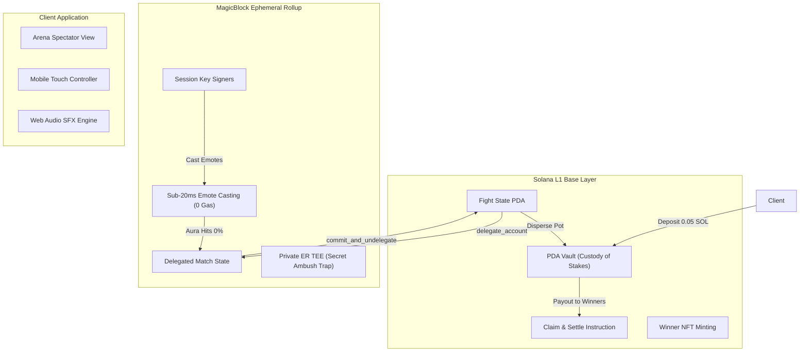

<div align="center">
  
  
  # 🥊⚡ Street Smack
  
  **The real-time, gasless on-chain meme aura battle on Solana.**  
  *Powered by MagicBlock Ephemeral Rollups (ER) & Private ER (TEE).*

  [](https://build.magicblock.app/?stage=blitz)
  [](https://docs.magicblock.gg)
  [](https://solana.com)
  [](https://github.com/toufiqfarhan0/street-smack)
</div>

<br/>

**Street Smack** is an on-chain multiplayer crowd battle where viral meme fighters face off in an intense aura tug-of-war. The entire room plays at once from their phones or desktop screens via QR code!

Deposit SOL into the **Solana L1 Vault PDA**, get assigned to a team, play **10-second fast-paced mini-games** to generate energy points, and spend points on high-frequency emote attacks that drain the opposing team's aura bar.

Every emote is a verifiable on-chain state update executed at **sub-20ms latency with 0 gas** inside a **MagicBlock Ephemeral Rollup (ER)**.

---

## 🌟 Why MagicBlock? (The 10x Upgrade over L1 & EVM)

Previous iterations on EVM chains (like Monad) were bottlenecked by 300ms block intervals, public mempool copycat front-running, and gas costs on every single emote.

With **MagicBlock on Solana**, Street Smack delivers:

| Metric / Feature | Vanilla L1 / Monad | Street Smack on MagicBlock ER |
| :--- | :--- | :--- |
| **Transaction Latency** | 300ms – 400ms | **Sub-20ms (30–50 ticks/sec real-time combat)** |
| **Emote Gas Fees** | Costly per action | **0 Gas inside the Ephemeral Rollup** |
| **Wallet UX** | Annoying popups / approvals | **Session Keys: Sign 1x on entry, tap freely** |
| **Custody & Safety** | State & funds coupled | **Solana L1 Vault PDA holds funds safely** |
| **Private Tactics** | Public mempool snooping | **Private ER (Intel TDX TEE) for secret ambush traps** |

---

## 🎮 The Gameplay Loop

```
       [ 📺 BIG SCREEN / SPECTATOR BROADCAST ]
  ┌────────────────────────────────────────────────────────┐
  │   🥊 TUNG TUNG (78%)   vs   🐶 TRALALERO (64%)         │
  │   [===========⚡ CENTRAL CLASH BEAM ⚡===========]      │
  │   Floating Action Pops: "DAB!", "QUOICOUBEH!", "GRIDDY"│
  │   📱 QR Code: "Scan to Join Team A or B Instantly"     │
  └────────────────────────────────────────────────────────┘
                              ▲
           MagicBlock ER Sub-20ms State Synchronization
                              ▼
           [ 📱 MOBILE CONTROLLER (YOUR PHONE) ]
  ┌────────────────────────────────────────────────────────┐
  │  TEAM A · ⚡ ENERGY: 380 PTS · DAMAGE DEALT: 540       │
  │                                                        │
  │  [⚡ 10s Mini-Game: Clicker / Target / Gauge / Noise]   │
  │                                                        │
  │  [6·7 (60 pts)]  [Dab (150 pts)]  [Griddy (300 pts)]   │
  │  [Quoicoubeh (500 pts)]  [🛡️ Arm Private ER Ambush]    │
  └────────────────────────────────────────────────────────┘
```

### 1. Dual-Screen Room Experience
- **Arena Broadcast View (`/#/arena`):** Designed for projectors, monitors, and livestreams. Shows procedural SVG bone-rigged animated mascots, dynamic health bars, screen shakes, floating damage numbers, and the phone join QR code.
- **Mobile Controller View (`/#/controller`):** Designed for players on their smartphones. Play mini-games, earn energy, spam attacks, and trigger combos without transaction prompts.

### 2. The 5 Cycling 10-Second Mini-Games
1. ⚡ **Speed Clicker (`clicker`):** Rapid tap speed challenge (+8 pts/tap with combo multipliers up to 4x).
2. 🎯 **Precision Target (`target`):** Quick-reaction moving target (+30 pts on hit, -10 pts on miss).
3. ⏱️ **Timing Gauge (`gauge`):** Stop the moving needle right in the center gold bullseye (+60 pts Jackpot).
4. 🃏 **Red or Black (`redblack`):** Card flip reaction (+25 pts correct, -20 pts wrong).
5. 🎙️ **Make Some Noise (`noise`):** **Uses the phone's microphone!** Players scream into their device to drive the VU meter into the red for massive points!

### 3. Emotes & SFX Engine
- **`6·7` (Cost: 60, -2 Aura):** Fast jab chant combo.
- **`Dab` (Cost: 150, -6 Aura):** Impact shockwave with authentic dab audio.
- **`Griddy` (Cost: 300, -14 Aura):** Right-foot-creep celebration flex.
- **`Quoicoubeh` (Cost: 500, -26 Aura):** Screen-shaking acoustic K.O. blast.

### 4. Private ER "Hidden Ambush" (Intel TDX TEE)
Players can spend 200 points to arm a **Secret Ambush Trap**. The trap is stored inside a **Private Ephemeral Rollup** and hardware-encrypted in the CPU's TEE. The enemy team cannot see the ambush on-chain until they attack into it, triggering a massive reflected damage explosion!

### 5. Settlement & Procedural Victory NFT Deck
When a team's aura bar hits 0%, a Street Fighter-style **K.O.!** triggers:
- The Ephemeral Rollup undelegates and commits the match proof to Solana L1.
- The **Solana L1 Vault PDA** automatically pays out the winning team proportionally.
- Each winning warrior draws an on-chain **Victory NFT Card**, where rarity scales with their personal share of team damage:
  - **Common:** < 8% damage share
  - **Rare:** 8% – 15% damage share
  - **Epic:** 15% – 25% damage share
  - **Legendary:** 25% – 40% damage share
  - **Mythic:** >= 40% damage share!

---

## 🏗️ Architecture



---

## 🚀 Quick Start

### Prerequisites
- Node.js 18+
- Rust & Cargo

### Installation

```bash
# Clone the repository
git clone https://github.com/toufiqfarhan0/street-smack.git
cd street-smack

# Install frontend dependencies
npm install

# Start local development server
npm run dev
```

Visit `http://localhost:5173/#/arena` to launch the Big Screen Arena, or `http://localhost:5173/#/controller` to test the phone controller.

---

## 📦 Monorepo Structure

| Directory / File | Description |
| :--- | :--- |
| 🦀 **`programs/street-smack/`** | Anchor Program for Solana L1 + MagicBlock ER (`create_fight`, `join_fight`, `cast_emote`, `claim_reward`). |
| 🎨 **`src/components/Arena.tsx`** | Big-screen spectator broadcast view with animated SVG bone rigs, clash beam, and QR code. |
| 📱 **`src/components/Controller.tsx`** | Mobile player controller with 10-second mini-games, emote attacks, and TEE ambush. |
| 🕹️ **`src/engine/minigames/`** | Real mini-games: Speed Clicker, Target, Gauge, RedBlack, and Noise mic decibel meter. |
| 🔊 **`src/engine/audio.ts`** | Authentic audio engine playing `67.mp3`, `dab.mp3`, `griddy.mp3`, and `quoicoubeh.mp3`. |
| 🦴 **`src/engine/fighters.tsx`** | Procedural vector bone rigging and animation engine for all 5 meme characters. |
| ⚡ **`src/engine/solana.ts`** | Solana Devnet connection, Session Keys, and MagicBlock Router RPC integration. |

---

## 📄 License

This project is open-source under the **MIT License**.
